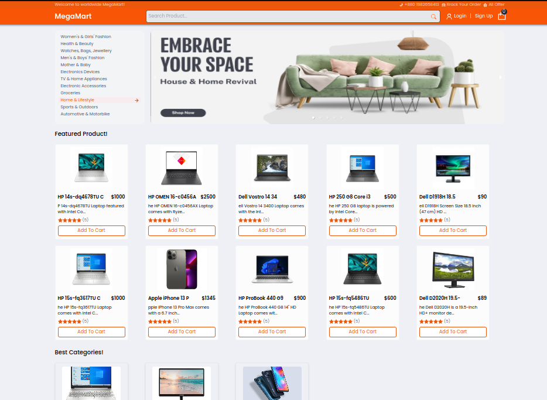

# Admin Dashboard
Url: https://tech-gadget.vercel.app/admin  
Username: admin@gmail.com  
password: password  

# TechGadgets E-commerce Website

Welcome to my React Redux eCommerce website! This project is a full-stack e-commerce solution built with React, Redux, Redux-toolkit and various other technologies. Whether you're a developer looking to contribute, a business owner interested in my platform, or just a curious user, this README will guide you through the essential details of my project.

## Table of Contents

- [Features](#features)
- [Technologies Used](#technologies-used)
- [Installation](#installation)
- [Usage](#usage)
- [Contributing](#contributing)
- [License](#license)

## Features

My React Redux TechGadgets eCommerce website features:

- **Product Catalog:** Browse and search for products across various categories.
- **User Authentication:** Register, login, and manage your user profile.
- **Shopping Cart:** Add and remove items from your cart, update quantities, and proceed to checkout.
- **Order Management:** View and manage your order history.
- **Admin Panel:** An admin interface for managing products, categories, and orders.
- **Responsive Design:** A mobile-friendly user interface for a seamless shopping experience on all devices.
- **Payment Integration:** Secure payment processing to complete orders.

## Technologies Used

- **React:** A popular JavaScript library for building user interfaces.
- **Redux:** A state management library for predictable application state.
- **React Router:** For handling navigation within the application. this react router i use (react-router-dom) v6.
- **Node.js:** A JavaScript runtime for building the server-side of the application.
- **Express.js:** A web application framework for building RESTful APIs.
- **Mongoose:** Mongoose is an Object Data Modeling (ODM) library for MongoDB.
- **Stripe:** Payment processing integration for secure transactions.
- **Tailwindcss:** For styling the user interface.
